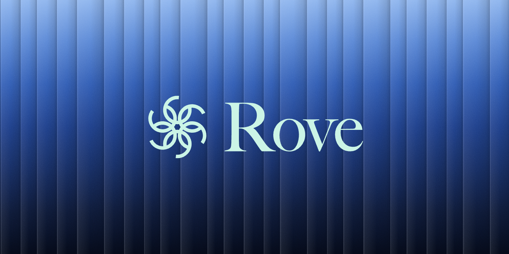

<p align="center">
  
</p>

<p align="center">
  <strong>A local-first recruiting assistant for job intake, application preparation, and auditable submission.</strong>
</p>

<p align="center">
  <a href="LICENSE"></a>
  
  
  
  <a href="https://github.com/GridGxly/Rove/actions/workflows/ci.yml"></a>
</p>

<p align="center">
  <a href="docs/showcase.md">Visual walkthrough</a> ·
  <a href="docs/getting-started.md">Set it up</a> ·
  <a href="docs/visual-benchmark.md">Recorded results</a>
</p>

> **Pre-alpha.** The real end-to-end acceptance gate remains unmet. The walkthrough shows a synthetic fixture; it does not establish reliable employer submissions or Qwen visual reasoning.

## Why this exists

Rove is meant for my personal internship search, but I opened it in case this same workflow is helpful for others.

It is built on [Erga](https://github.com/Adr1an04/erga-mcp), which already handles application tracking, resume tailoring, project evidence, and recruiting-mail reconciliation. I wanted to automate the part I was still doing by hand: opening each application, filling the form, answering the written questions, sending it, and following what happens afterward.

Rove is not an official Erga project and is not affiliated with its maintainer. Adrian and the Erga contributors did the original Erga work. Rove builds on it under the MIT license and adds browser automation, a Discord control surface, local applicant memory, and application orchestration. See [THIRD_PARTY_NOTICES.md](THIRD_PARTY_NOTICES.md) for attribution.

## What it does

1. A feed service reads the [Keryx](https://github.com/GodlyDonuts/keryx) job list every 15 minutes, posts each new matching internship to a Discord channel once, and queues it. A link I paste in Discord is worked before any feed job.
2. A worker opens the posting in a dedicated Chrome that stays in the background. Local Qwen3.8-27B lists the posting's hard requirements and code compares them with my approved facts. A feed job that conflicts with one of them waits for my decision.
3. Erga tailors a resume from approved evidence. If the tailored resume fails Erga's checks, the approved base PDF is used and the thread says so.
4. Code fills the form from a frozen copy of the approved profile and verifies each value. A question the profile does not cover is filled from an answer I gave on an earlier form. What is left goes to Qwen for a draft, or to me when only I know the answer.
5. Written drafts are scanned against the [Unslop](https://github.com/theclaymethod/unslop) and [Humanizer](https://github.com/blader/humanizer) rules, follow a sample of my own writing when the vault has one, and can use a short summary of the employer's public site.
6. When the form is complete, Rove sends it once and reads the confirmation. Sending needs my `send it` reply unless I turn on the `auto_submit` policy, which has a daily cap and a minimum gap between sends.
7. Each application has its own Discord forum thread with the filled values, the drafts, the resume PDF, a screenshot when a run stops, and the result.
8. An optional mail service reads a Zoho inbox and moves a sent application to OA, Interview, Offer or Rejected.

Rove tries recognised picture checks with a bounded local solver. It asks me when that fails, an account step needs approval, a fact is missing, approved facts conflict, or a submission result is unclear. Supported email codes come from the optional Zoho integration; SMS and authenticator MFA remain manual. An unclear submission is never retried by code.

Discord is the remote control. The model, the vault, the database, resumes, the browser profile, credentials and the application history stay on my Mac.

## One application, from link to outcome


This is a workflow illustration. The [visual walkthrough](docs/showcase.md) pairs it with actual before-and-after captures from the synthetic browser fixture, the server and database checks, and the current live limitations.

## Architecture

```text
Discord
  │
  ▼
Rove
  │
  ├── Qwen3.8-27B      local reasoning
  ├── Hermes Agent     sessions, tools, MCP, hot memory
  ├── Erga             career evidence, resumes, application state
  ├── Obsidian         long-term readable memory
  │     └── QMD        local search over the approved profile
  ├── SQLite           transactional workflow state
  ├── Browser daemon   background Chrome driven over a local DevTools port
  └── Zoho Mail        optional recruiting mail
```

Obsidian holds what I want to read and edit: the approved profile, a voice sample, application notes and company research. SQLite holds state that must be exact: the queue, submission attempts, Discord bindings, remembered answers and mail checkpoints. Resumes, receipts and screenshots are private files. Hermes' built-in memory stays small.

Qwen handles judgment: job fit, unfamiliar questions, written answers, and mail the rules cannot classify. Code owns permissions, validation, state changes and the Submit click. The model has no submit tool.

## Documentation

- [How it works](docs/how-it-works.md): the components and the path of one application
- [Application workflow](docs/application-workflow.md): intake, job fit, answers, sending, mail tracking, and current limits
- [Discord](docs/discord.md): channels, cards, and the replies Rove accepts
- [Browser automation](docs/browser-automation.md): the recruiting browser and how forms are filled
- [Memory and storage](docs/memory-and-storage.md): where each kind of data lives
- [Requirements](docs/requirements.md): the full install checklist and configuration keys
- [Getting started](docs/getting-started.md): setup in order
- [Visual walkthrough](docs/showcase.md): a synthetic application and the evidence behind it
- [Qwen visual benchmark](docs/visual-benchmark.md): recorded failures and the evidence required for the MVP
- [Security](SECURITY.md) and [Prompt injection](docs/prompt-injection.md): the trust model

The rest is listed in [docs/README.md](docs/README.md).

## Local model

The reference checkpoint is [OrcaRouter's Qwen3.8-27B MLX conversion](https://huggingface.co/orcarouter/Qwen3.8-27B-Uncensored-MLX) at 4-bit, served on localhost by oMLX as `Qwen3.8-27B-Uncensored-4bit`. The tested revision, settings and a [quick inference check](docs/local-runtime.md#quick-inference-check) are in [Local runtime](docs/local-runtime.md). [Runtime measurements](docs/runtime-benchmarks.md) separates model speed from workflow verification.

## Hardware

I develop on a 14-inch MacBook Pro with an M5 Pro (18-core CPU, 20-core GPU), 48GB of unified memory and a 1TB SSD. The stack is tuned for that machine.

This Mac has loaded the model and completed local inference. That establishes that 48GB can run the reference configuration, not that every desktop workload has enough headroom. Monitor memory pressure and swap during requests; model weight size alone is insufficient. A 64GB configuration has more capacity, but has not been tested here.

You do not need the same Mac. On different hardware, expect to change the model or quantization, the context size and the retention settings in your own clone. [Will this run on my machine?](docs/hardware-check.md) has a prompt you can give another model or coding agent so it can read the repo, compare it with your hardware, and suggest a starting configuration without inventing benchmark numbers.

Apple Silicon macOS is the only platform I test.

## Requirements

- macOS on Apple Silicon
- Python 3.12 through 3.14, [`uv`](https://docs.astral.sh/uv/), Git
- oMLX with the Qwen3.8-27B MLX weights
- Hermes Agent
- Erga, installed from the Rove fork
- Tectonic for resume compilation
- a private Obsidian vault
- QMD and Node.js 22+ for local profile retrieval
- Google Chrome; `rove browser install` makes a separate copy of it, the Rove Browser, driven with Patchright
- your own Discord bot in a private server you own
- optional: Zoho Mail API access for mail tracking

[Requirements](docs/requirements.md) is the full checklist, including how to create the Discord bot and every configuration key.

## Security and privacy

Rove handles personal recruiting data and can send applications. Treat anything committed to this repository as public.

Real profiles, the vault, resumes, browser sessions, credentials, receipts, recruiting mail, screenshots, logs and databases live outside the Git checkout, under `~/.config/rove` by default. Examples and tests use synthetic people, companies and credentials.

Read [SECURITY.md](SECURITY.md), [Browser automation](docs/browser-automation.md) and [Prompt injection](docs/prompt-injection.md) before connecting Discord, the browser, Zoho or real application data.

## Getting started

Rove is pre-alpha and has no one-command installer.

```bash
git clone --branch docs-initial-setup https://github.com/GridGxly/Rove.git
cd Rove
uv sync --frozen --python 3.12
```

`docs-initial-setup` contains the current pre-alpha implementation; `main` may lag while changes are under review. Then follow [Getting started](docs/getting-started.md). Start with synthetic data and leave submission off until preparation works on your machine.

If you want the original recruiting assistant without browser auto-application, use [Erga](https://github.com/Adr1an04/erga-mcp) directly.

## Status

Rove runs my own search on one Mac. The pieces above are implemented and covered by an offline test suite. These limits matter most:

The MVP acceptance gate is still unmet: zero verified full-game completions and zero confirmed submissions for the seven selected validation jobs. The latest Oracle test retrieved and accepted an email verification code, then stopped on form controls. It did not submit. Offline fixture success and local inference checks do not establish real application completion.

- Forms are filled only on a fixed list of applicant-tracking hosts, and only when the form belongs to the same job as the queued link.
- Public Greenhouse, public Lever and generic page-confirmation adapters are available, with additional board modules enabled separately in local configuration. Their fixtures establish specific behavior, not broad live success rates. Where no enabled adapter matches, Rove fills the form and I press Submit.
- The local CAPTCHA solver is experimental; visual recognition has failed in recorded trials. Set `captcha_solver` to `manual` to leave picture checks to yourself. SMS/authenticator MFA remains manual, and Rove uses no proxies.
- The `Accepted` and `Withdrawn` states are not set by code, and there are no reminders.

[Application workflow](docs/application-workflow.md#limits) has the full list. The definition of done is in the [product requirements](docs/prd.md).

Sending an application cannot be undone. Submission is off until you enable it in private configuration.

## Contributing

Focused issues and pull requests are welcome. Read [CONTRIBUTING.md](CONTRIBUTING.md) before changing application state, browser permissions, profile memory, resume evidence, or security boundaries.

## Author

Built by [Ralph Clavens Love Noel](https://github.com/GridGxly).
