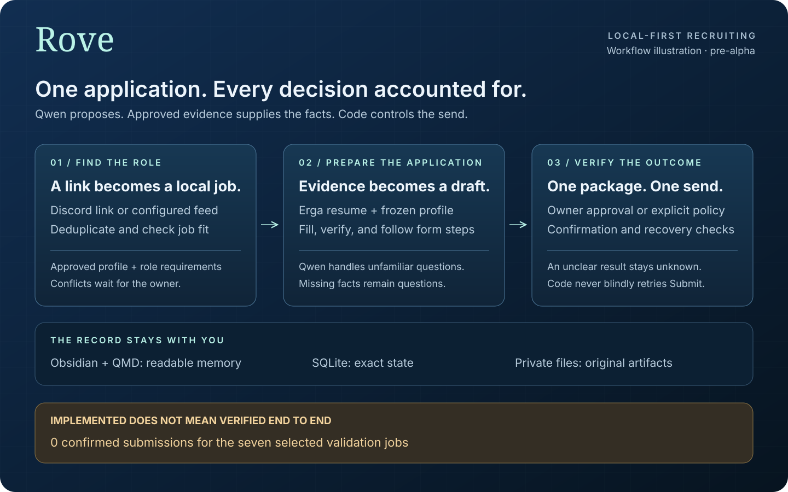
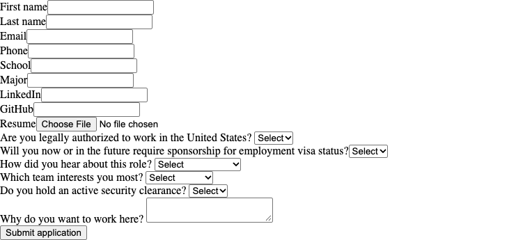
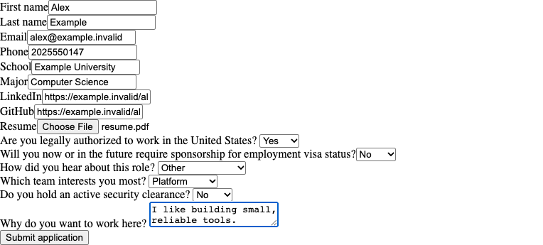

# Rove, from job link to recorded outcome

Rove brings the application workflow onto your machine: intake, evidence-backed preparation, a dedicated recruiting browser, owner decisions, and an exact record of the result. Discord is the control surface. Qwen handles judgment; code owns permissions, validation, and submission.

**This is a pre-alpha walkthrough. There are zero confirmed submissions for the seven selected validation jobs.**



The graphic describes the implemented workflow. It is an illustration, not a screenshot or a claim that the live acceptance test passed.

## 1. Start with a job and approved facts

A Discord link or an enabled feed enters a deduplicated local queue. Rove checks the role against an approved profile, then uses Erga evidence to prepare a resume. Each application references a frozen profile and package rather than whatever the model remembers later.

[How it works](how-it-works.md) explains the components. [Memory and storage](memory-and-storage.md) explains the split between readable Obsidian notes, QMD retrieval, SQLite state, and private artifacts.

## 2. Fill what is known, ask for what is missing

These are actual captures of the existing, unstyled Example Labs fixture on October 4, 2026. The worker ran the form through Google Chrome in a fresh synthetic state root. Only the form element is captured; the page and its contents were not restyled for presentation.

| Before preparation | After preparation and the synthetic owner's answer |
| --- | --- |
|  |  |

The first preparation pass filled known values and left an owner-only clearance question unanswered. A second pass with no new facts kept that hold. The fixture then supplied the synthetic owner's answer through the normal command handler; preparation finished and the configured fixture policy allowed sending.

Qwen, Erga, and Discord used the existing test stand-ins. The fixed drafting response is test data, not model output or a measurement of Qwen's reasoning. The resume is synthetic fixture bytes, not a real applicant resume. Qwen/oMLX remained stopped throughout this capture.

## 3. Check the receiving side and durable state

A filled form is only preparation. In this fixture, the loopback employer server independently validates the transmitted fields and resume bytes before returning its confirmation. It rejects missing, duplicate, or incorrect fields and a second accepted submission.

| Boundary | Observed result |
| --- | --- |
| Browser | Form prepared in Google Chrome 154.0.8037.97 |
| Receiving server | One accepted application; all 14 expected text fields and the resume bytes matched |
| Independent SQLite connection | One application row and one submission-attempt row, both `APPLIED` |
| Outcome recovery outbox | Zero pending rows after outcome processing |
| External services | Qwen, Erga, and Discord were stand-ins; no real employer submission |

The [capture check](assets/showcase/fixture-check.json) contains the reviewed counts and synthetic resume hash. Raw captures, state, and logs stay outside Git. An initial capture script incorrectly expected the processed outcome outbox to retain a row; that assertion failed and its artifacts were preserved. The reviewed capture checks the durable application and attempt rows and the drained outbox. No production behavior changed to obtain this result.

The capture substituted Chrome for the fixture's normal Patchright Chromium launch and added screenshots. It is a demonstration, not a latency benchmark. Production destination rules were replaced by the fixture's loopback-only rules. It does not certify live ATS navigation, email delivery, Erga synchronization, Discord delivery, or Qwen reasoning.

To run the standard fixture with Patchright Chromium:

```bash
uv sync --frozen --python 3.12
uv run patchright install chromium
uv run rove bench fixture
```

That command uses synthetic state and stand-ins, requires no model server, and does not reproduce the extra Chrome screenshots. [Contributing](../CONTRIBUTING.md#checks) lists the regression tests, including receiving-server validation and crash recovery.

## 4. Keep the live gaps separate

| Area | Current evidence and limit |
| --- | --- |
| Qwen visual recognition | The local picture-check solver remains experimental. An unresolved challenge needs the owner; reliable autonomous completion has not been established. |
| Browser and control behavior | The live Oracle attempt accepted an email verification code, then stopped on form controls. Fixture regressions exercise specific controls; live recovery is still unverified. |
| Approved applicant facts | An unknown required fact needs the owner's answer. Model inference and public research cannot supply it. |
| Outcome verification | None of the seven selected validation jobs has a confirmed submission. Employer confirmation, durable records, Discord delivery, recruiting mail, and vault notes still need to agree. |

Local inference has run on the reference 48GB Mac. The [runtime measurements](runtime-benchmarks.md) include failed checks, workload conditions, and memory pressure; they do not establish sustained stability or full workflow completion.

Start with [Getting started](getting-started.md) and keep submission disabled while checking preparation on your machine. Real profiles, email, resumes, browser sessions, and application evidence belong outside the public repository. Rove builds on [Erga](https://github.com/Adr1an04/erga-mcp); preserve its [attribution and license notices](../THIRD_PARTY_NOTICES.md).
