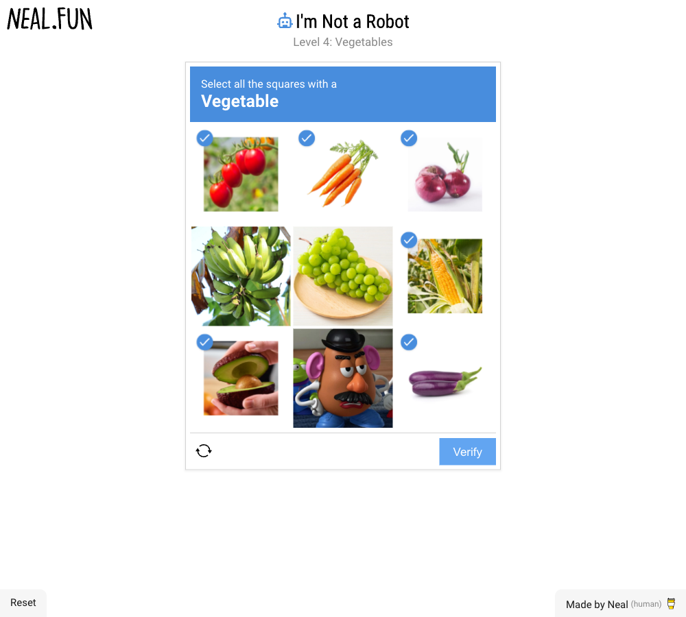

# Qwen visual benchmark

**The full game has not been verified complete. The seven-job acceptance test has not
passed. These results do not establish an MVP or a reliable CAPTCHA success rate.**

This records Qwen's performance on [I'm Not a Robot](https://neal.fun/not-a-robot/),
with failures retained. The game is a visual reasoning stress test. It does not test
email verification, truthful form answers, employer submission receipts, or delivery
to Discord and Obsidian. Those require separate workflow evidence.

## Recorded results — October 4, 2026

| Session | Starting point | Verified progress | Outcome |
| --- | --- | --- | --- |
| Development 01, segment 1 | Level 1 | Advanced to Level 2 | Qwen claimed completion too early. The screenshot showed another level. |
| Development 01, segment 2 | Same profile, resumed at Level 2 | Advanced through Levels 2 and 3 to Level 4 | Stopped after 13 actions without level progress. An invalid click was rejected; a later completion claim was also rejected. |
| Fresh 01 | Fresh profile, Level 1 | Advanced to Level 2 | Thinking enabled, 3,072-token output budget. The next decision took over four minutes and returned invalid JSON. The runner was interrupted during the following decision; no human puzzle actions were supplied. |
| Fresh 02 | Fresh profile, Level 1 | Advanced to Level 3 | Thinking disabled, 768-token output budget, up to two screenshots per decision. Qwen entered an unsuccessful text answer and repeatedly pressed Verify without correcting it. Interrupted after 11 recorded actions to improve generic observation feedback; no human answers or puzzle inputs. |
| Fresh 03 | Fresh profile, Level 1 | Advanced to Level 3 | One screenshot, model-requested zoom, and visible input feedback. Stopped at the configured limit of 24 actions without a level change, after 30 actions and 594 seconds. Malformed JSON, focus errors, and unsuccessful text answers remain in the record. No operator puzzle input. |
| Fresh 04 | Fresh profile, Level 1 | Advanced to Level 2 | JSON output mode, longer action history and magnified crops. Stopped after 25 actions and 357 seconds, including repeated zoom/unzoom and unsuccessful selections. No operator puzzle input. |
| Fresh 05 | Fresh profile, Level 1 | Advanced to Level 3 | Brief visible observation plus action. Stopped after 28 actions and 776 seconds; unsuccessful text submissions, response-format errors, focus errors and repeated zoom. No operator puzzle input. |
| Fresh 06 | Fresh profile, Level 1 | Advanced to Level 3 | Observed button/input references and keyboard events. Stopped after 27 actions and 854 seconds. Incorrect text submissions, repeated zooming and invalid actions remain in the record. No operator puzzle input. |
| Fresh 07 | Fresh profile, Level 1 | Advanced to Level 2 | Model-requested frame sequences available but never used. Stopped after 25 actions and 306 seconds, with repeated malformed button actions. No operator puzzle input. |
| Fresh 08 | Fresh headed profile | No independently verified game progress | Initial screenshot timed out before any model decision. Saved text names Level 1, but no final screenshot exists. Infrastructure failure; total elapsed time was not preserved. |
| Fresh 09 | Fresh headless profile | Game never appeared | Ten recorded model actions on Cloudflare's access-verification page before operator interruption. The last recorded elapsed time is 131 seconds. Startup/access failure, not a game-accuracy measurement. |
| Fresh 10 | Fresh headed profile, Level 1 | Advanced to Level 3 | Stopped at the owner's pause request after nine recorded actions. Text entry and Submit worked, but answers were rejected. The last recorded elapsed time is 101 seconds, not total time to interruption. No human puzzle input. |

The development rows are two segments of **one session**, not two independent trials.
Fresh 01 through Fresh 10 are separate sessions. There are zero verified full-game completions in this
record. No accuracy percentage is inferred from it. The development segments used
temperature 0, disabled thinking, and a 512-token output
limit. They did not preserve per-decision timing or the complete original prompt, so
they are exploratory evidence rather than a reproducible performance measurement.

The [action record](assets/benchmarks/not-a-robot/development-01.json) contains what
Qwen actually requested, including the malformed action. The independently inspected
final screenshot shows the unresolved Level 4:



The [Fresh 01 record](assets/benchmarks/not-a-robot/fresh-01.json) preserves the separate
attempt's settings, actions, timing, and interruption. It is an incomplete attempt,
not a successful completion or an independent proof of game accuracy.

The [Fresh 02 record](assets/benchmarks/not-a-robot/fresh-02.json) includes its repeated
unsuccessful actions. Subsequent runner changes use one screenshot per decision,
explicit feedback about the clicked control and focused visible input, and a
model-requested zoom tool. These are changes to observation and interaction; they
supply no puzzle answer. Results from different runner revisions are not pooled as
an accuracy rate.

The [Fresh 03 record](assets/benchmarks/not-a-robot/fresh-03.json) contains the complete
attempt through its automatic stop. Subsequent runner changes request JSON output
from the model server, retain more recent action feedback, report why invalid actions
failed, recognize both Submit and Verify attempts, and magnify model-requested crops.
No character, tile selection, or other puzzle answer is supplied by these changes.

The [Fresh 04 record](assets/benchmarks/not-a-robot/fresh-04.json) retains the complete
automatically stopped attempt. JSON output eliminated malformed actions in this run,
but did not establish correct visual reasoning or game completion.

The [Fresh 05 record](assets/benchmarks/not-a-robot/fresh-05.json) includes its failed
text submissions and action-format errors. These attempts ran alongside local
development and tests. Timings describe that workload, not an isolated latency
benchmark. No success rate is inferred from these changing methods.

The [Fresh 06 record](assets/benchmarks/not-a-robot/fresh-06.json) preserves the failed
run with referenced controls. The final screenshot still shows Level 3; successful
input delivery is not successful puzzle solving. Local model logs also showed memory
throttling during this attempt, so its later slow decisions are not a controlled
comparison with the earlier trials.

The [Fresh 07 record](assets/benchmarks/not-a-robot/fresh-07.json) retains the failed
attempt with a general frame-sequence tool. Qwen did not request it. The runner rejected
`click` actions with a control reference because this revision required `control` for
referenced buttons; it did not correct this repeated error. The next revision accepts
both spellings with the same stale-control checks. This is an interaction change, not
a provided puzzle answer. No concurrent browser tests or model requests ran during
Fresh 07, although ordinary local development continued.

The [Fresh 08 record](assets/benchmarks/not-a-robot/fresh-08.json) and
[Fresh 09 record](assets/benchmarks/not-a-robot/fresh-09.json) retain these setup failures.
The next runner revision brings the headed window forward and waits up to fifteen
seconds for a visible numbered game level before requesting any model action. It
records a startup failure when the game does not appear. These changes do not prove
the cause of the screenshot timeout or resolve the site's access check. Headed mode
remains the default; `--headless` is an optional, separately recorded mode.

The [Fresh 10 record](assets/benchmarks/not-a-robot/fresh-10.json) preserves the attempt
stopped at the owner's request. It reached the game and advanced through its first two
levels. Independent review of the final screenshot confirms that Level 3 remained
unresolved. Successful browser input did not establish successful text recognition.

## Reproducible runner

[`scripts/benchmark_visual_game.py`](../scripts/benchmark_visual_game.py) runs the game
with the same local Qwen model used by Rove. Every attempt starts a fresh, separate
browser profile. The runner records its source hash, prompt hash, model revision,
settings, decision times, action outcomes, page text, and before/after screenshots.
Artifacts remain in the private state root until reviewed for publication.
Install the development dependencies with `uv sync` first; Pillow is used only to
magnify model-requested screenshot crops. Interrupted attempts retain their partial record.

```sh
uv run python scripts/benchmark_visual_game.py \
  --executable "$HOME/.config/rove/browser/Rove Browser.app/Contents/MacOS/Google Chrome"
```

The measured model is `Qwen3.8-27B-Uncensored-4bit`, served locally by oMLX. The fresh
runner disables thinking, uses temperature 0 and at most 768 output tokens, and shows
a 1,000 × 900 viewport. See [Local runtime](local-runtime.md) and
[Runtime measurements](runtime-benchmarks.md) for the reference installation.

Qwen receives screenshots, visible page text, observed button/input references, and
feedback from its own previous actions. Referenced controls are checked again before
use; typing emits keyboard events as well as input events. Qwen may request two to four
time-ordered frames, with bounded spacing, to inspect animation itself. These generic tools are
tested on synthetic pages without game answers. The runner has no answer bank, level-specific strategy, game-source access,
or way to mutate game state. Mouse and keyboard actions are bounded by code. It does
not learn model weights from playing. Any human intervention or change to this method
must be disclosed with the affected attempt.

The runner rejects a completion claim while a numbered level remains visible. A
claim without a numbered level is only a candidate for independent review; it never
sets `verified_complete` to true itself. Completion requires the actual end screen,
the recorded progression, and review of the evidence. A run stops after 24 actions
without a level change or its total action budget. Stopping is a failed/incomplete
attempt, not a pass.

The separate browser keeps recruiting credentials out of this test. It takes the
workflow lock while using Qwen, so recruiting work resumes after the test ends.

## What counts as the MVP acceptance result

The requested acceptance gate requires both a verified full-game completion without
provided answers and confirmed submissions for all seven owner-selected jobs through
Rove. Application confirmation, private records, Discord delivery, recruiting mail,
and Obsidian notes must agree. A successful click, a model's claim, an email-code
request, or a CAPTCHA disappearing is not an application receipt.

One successful run would establish that the workflow can pass this acceptance test.
Reliability across repeated runs requires additional independent trials, reported with
their failures, retries, timing, and any interventions. Private applicant data and
credentials do not belong in the public evidence.
